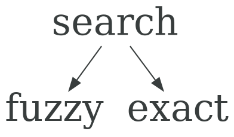
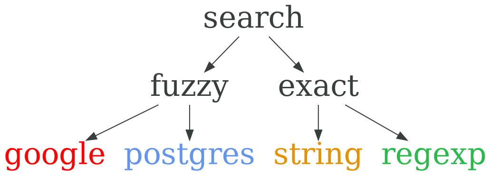

## Регулярные выражения { data-transition="none" }

### Поиск { data-transition="none" }

<p class="fragment fade-out" data-fragment-index="1">

</p>

<p class="fragment" data-fragment-index="1" style="margin-left: -20px;">

</p>

### Шаблоны { data-transition="none" }

```1c
DD.MM.YYYY
```

```ruby
Time.now.strftime("%d.%m.%Y") # => "16.09.2018"
```

<script type="text/javascript" src="regex-colorizer.js">
</script>

<script type="text/javascript">
RegexColorizer.colorizeAll();
</script>