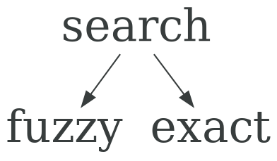
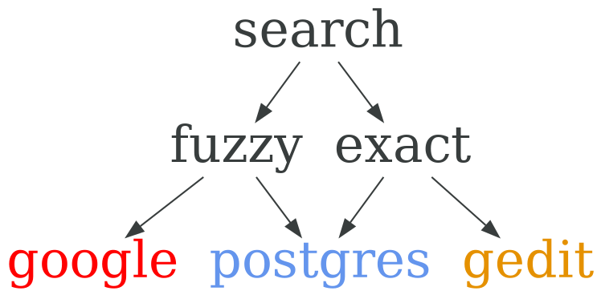

## Регулярные выражения { data-transition="none" }

### Поиск { data-transition="none" }

<p class="fragment fade-out" data-fragment-index="1">

</p>

<p class="fragment" data-fragment-index="1" style="margin-left: -24px;">

</p>

### Форматная строка / Маска { data-transition="none" }

Похоже, но не эквивалентно

```
DD.MM.YYYY
```

```
#(###) ###-##-##
```

```ruby
Time.now.strftime("%d.%m.%Y") # => "16.09.2018"
```

### Из чего состоят { data-transition="none" }

* Символьные классы
* Квантификаторы
* Альтернативы и группировки
* Модификаторы

### Символьные классы { data-transition="none" }

```regex
[0-9]
[-0-9]
[0-9-]
[^0-9]
[0-9^]
\d
\D
```

### Квантификаторы { data-transition="none" }

* `?` - 0 или 1
* `+` - 1 или много
* `*` - 0 или много
* `{1,2}` - 1 или 2
* `{2,}` - больше 2
* `{,2}` - меньше 2

### Альтернативы { data-transition="none" }

```regex
(one|two)
```

### Жадный или ленивый { data-transition="none" }

```regex
.*?
```

### Группировки { data-transition="none" }

С сохранением в переменные `$1`, `$2`
```regex
(a|b)
```

Без сохранения

```regex
(?:a|b)
```

### Модификаторы { data-transition="none" }

```regex
/[Aa][Bb][Cc]/
/abc/i
```

* **m**ultiline
* **i**gnorcase
* e**x**tended

### Якоря

```regex
^Start of line
End of line$
\AStart of string
End of string\z
```

### Уровни трансляции { data-transition="none" }

```dot
digraph {
  bgcolor="transparent"
  node [shape="none" fontsize="30.0"]
  lexical ->
  syntactic ->
  semantic
}
```

<script type="text/javascript" src="regex-colorizer.js">
</script>

<script type="text/javascript">
RegexColorizer.colorizeAll();
</script>